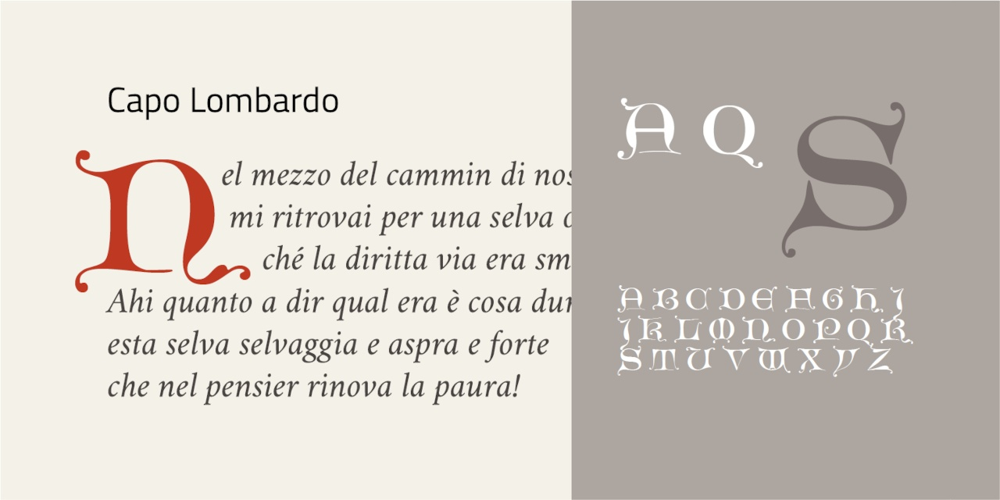

# Capo Lombardo
- Versione 1.0: versione iniziale.

Per testare il font, vedere la [pagina interattiva](https://m-casanova.github.io/CapoLombardo/).

## Descrizione

Il font **Capo Lombardo** è basato su scansioni di disegni di capolettera di Alois Studnička (1842-1927) da [Archive](https://archive.org/details/abeceda-sbirka_pisem/page/n18/mode/1up).

Sono presenti varianti per le lettere _U W_, accessibili tramite caratteristica '**ss01**'.
